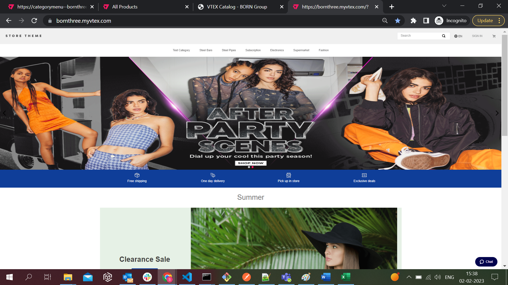
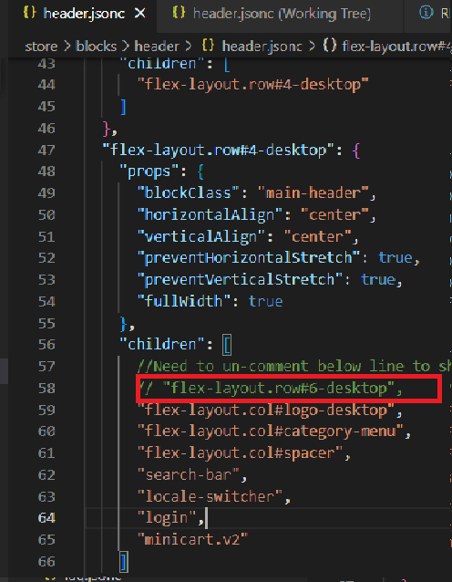

# Store theme
<!-- ALL-CONTRIBUTORS-BADGE:START - Do not remove or modify this section -->

<!-- ALL-CONTRIBUTORS-BADGE:END -->
Our boilerplate theme to create stores in the VTEX IO platform.

Uninstall existing theme in your workspace 
  
  `vtex unlink vtex.store-theme@<Verion Number>`

link you theme by using `vtex link` command

## Preview

## Feature configured in version 1.0.0

  - Autocomplete Search
  - Category Menu
  - Social Login
  - Similar Products Variants
  - Wish List

## Feature configured in version 2.0.0
  - Mega Menu
      - [Mega Menu Confluence Page](https://borngroup.atlassian.net/wiki/spaces/VPP/pages/4954980895/VPP-259+Mega+Menu+Configuration)

      - Uncomment below line in `header.jsonc` for enabling Mega Menu. 
      

## Feature configured in version 2.0.2

  - Configured related products in PDP page
    - [VPP-293-confluence-page](https://borngroup.atlassian.net/wiki/spaces/VPP/pages/4972052870/VPP-293+Configure+related+products+in+PDP+page)
  
  - Configured multiple product comparison
    - [VPP-269-product-comparison](https://borngroup.atlassian.net/wiki/spaces/VPP/pages/4957929569/VPP-269+Multiple+Product+Comparison+which+belongs+to+similar+category)
  
  - Configured product availability
    -[VPP-273-product-availability](https://borngroup.atlassian.net/wiki/spaces/VPP/pages/4958060598/VPP-273+Show+the+available+stock+on+PDP+if+it+is+less+then+defined+value.)